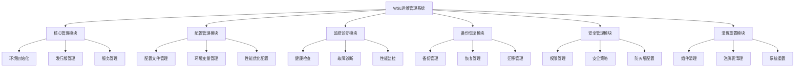

# WSL运维管理系统设计文档

## 概述

WSL运维管理系统是一个基于PowerShell和批处理脚本的自动化工具集，旨在提供WSL环境的完整生命周期管理。系统采用模块化设计，每个功能模块独立运行，同时提供统一的管理界面和配置系统。

## 架构

### 系统架构图



### 技术栈

- **主要语言**: PowerShell 5.1+
- **辅助脚本**: Windows批处理 (.bat/.cmd)
- **配置格式**: JSON, YAML
- **日志系统**: Windows Event Log + 文件日志
- **WSL命令**: wsl.exe, wslconfig.exe
- **系统工具**: reg.exe, sc.exe, taskkill.exe

## 组件和接口

### 1. 核心管理模块 (WSLCore)

**职责**: WSL基础服务管理和环境控制

**主要接口**:
```powershell
# 环境初始化
Initialize-WSLEnvironment [-Distribution <String>] [-Force]

# 服务管理
Start-WSLService [-Distribution <String>]
Stop-WSLService [-Distribution <String>] [-Force]
Restart-WSLService [-Distribution <String>]

# 发行版管理
Install-WSLDistribution [-Name <String>] [-Source <String>]
Remove-WSLDistribution [-Name <String>] [-Force]
Get-WSLDistributionList
```

**核心功能**:
- WSL2特性检测和启用
- Linux发行版自动安装和配置
- WSL服务状态管理
- 基础开发环境配置

### 2. 配置管理模块 (WSLConfig)

**职责**: 系统配置和参数管理

**主要接口**:
```powershell
# 配置管理
Set-WSLConfiguration [-ConfigFile <String>] [-Parameters <Hashtable>]
Get-WSLConfiguration [-Section <String>]
Reset-WSLConfiguration [-Section <String>]

# 性能优化
Optimize-WSLPerformance [-Profile <String>]
Set-WSLResourceLimits [-Memory <String>] [-Processors <Int>]
```

**配置文件结构**:
```json
{
  "wsl": {
    "memory": "8GB",
    "processors": 4,
    "swap": "2GB",
    "localhostForwarding": true
  },
  "network": {
    "generateHosts": true,
    "generateResolvConf": true
  },
  "interop": {
    "enabled": true,
    "appendWindowsPath": true
  }
}
```

### 3. 监控诊断模块 (WSLMonitor)

**职责**: 系统健康监控和故障诊断

**主要接口**:
```powershell
# 健康检查
Test-WSLHealth [-Detailed] [-OutputFormat <String>]
Get-WSLSystemInfo
Get-WSLResourceUsage

# 故障诊断
Invoke-WSLDiagnostics [-ProblemType <String>] [-AutoFix]
Repair-WSLConfiguration [-Component <String>]
Test-WSLNetworkConnectivity
```

**监控指标**:
- WSL服务运行状态
- 内存和CPU使用率
- 磁盘空间使用情况
- 网络连接状态
- 文件系统健康状态

### 4. 备份恢复模块 (WSLBackup)

**职责**: 环境备份、恢复和迁移

**主要接口**:
```powershell
# 备份管理
New-WSLBackup [-Distribution <String>] [-BackupPath <String>] [-Incremental]
Restore-WSLBackup [-BackupFile <String>] [-TargetName <String>]
Get-WSLBackupList [-BackupPath <String>]

# 迁移管理
Export-WSLDistribution [-Name <String>] [-OutputPath <String>]
Import-WSLDistribution [-ImportFile <String>] [-Name <String>]
```

**备份策略**:
- 完整备份: 整个发行版的tar归档
- 增量备份: 基于文件修改时间的差异备份
- 配置备份: 单独备份配置文件和用户设置
- 自动备份: 定时任务触发的自动备份

### 5. 安全管理模块 (WSLSecurity)

**职责**: 安全配置和权限管理

**主要接口**:
```powershell
# 安全配置
Set-WSLSecurityPolicy [-PolicyFile <String>]
Test-WSLSecurityCompliance
Enable-WSLFirewall [-Rules <String[]>]

# 权限管理
Set-WSLUserPermissions [-User <String>] [-Permissions <String[]>]
Get-WSLSecurityAudit
```

**安全特性**:
- 文件系统权限控制
- 网络访问限制
- 用户权限管理
- 安全审计日志

### 6. 清理重置模块 (WSLCleanup)

**职责**: 系统清理和完全重置

**主要接口**:
```powershell
# 清理操作
Remove-WSLComponents [-ComponentType <String[]>] [-Force]
Clear-WSLCache [-CacheType <String>]
Reset-WSLToDefault [-BackupFirst]

# 完全卸载
Uninstall-WSLCompletely [-PreserveData] [-Force]
```

**清理范围**:
- WSL发行版和虚拟磁盘
- 注册表项和系统配置
- 缓存文件和临时数据
- WSL内核和驱动程序
- 用户配置和环境变量

## 数据模型

### WSL环境配置模型
```json
{
  "environmentId": "string",
  "distributionName": "string",
  "version": "string",
  "status": "Running|Stopped|Installing",
  "configuration": {
    "memory": "string",
    "processors": "number",
    "swap": "string",
    "kernel": "string"
  },
  "network": {
    "hostname": "string",
    "ipAddress": "string",
    "dnsServers": ["string"]
  },
  "storage": {
    "diskPath": "string",
    "diskSize": "string",
    "usedSpace": "string"
  },
  "lastBackup": "datetime",
  "healthStatus": "Healthy|Warning|Critical"
}
```

### 备份记录模型
```json
{
  "backupId": "string",
  "distributionName": "string",
  "backupType": "Full|Incremental|Configuration",
  "backupPath": "string",
  "createdDate": "datetime",
  "size": "string",
  "checksum": "string",
  "metadata": {
    "version": "string",
    "installedPackages": ["string"],
    "userAccounts": ["string"]
  }
}
```

## 错误处理

### 错误分类和处理策略

1. **系统级错误**
   - WSL功能未启用: 自动启用Hyper-V和WSL功能
   - 权限不足: 提示以管理员身份运行
   - 系统不兼容: 检查Windows版本和硬件支持

2. **配置错误**
   - 配置文件损坏: 使用默认配置重置
   - 参数无效: 验证并提供有效值建议
   - 路径不存在: 自动创建必要目录

3. **运行时错误**
   - 服务启动失败: 诊断并修复服务依赖
   - 网络连接问题: 重置网络配置
   - 磁盘空间不足: 清理缓存和临时文件

### 错误恢复机制

```powershell
# 错误处理框架
try {
    # 主要操作
    Invoke-WSLOperation
}
catch [WSLServiceException] {
    Write-WSLLog -Level Error -Message $_.Exception.Message
    Invoke-WSLServiceRecovery
}
catch [WSLConfigurationException] {
    Reset-WSLConfiguration -Component $_.Exception.Component
}
catch {
    # 通用错误处理
    Write-WSLLog -Level Critical -Message "Unexpected error: $($_.Exception.Message)"
    Invoke-WSLEmergencyRecovery
}
```

## 测试策略

### 单元测试
- 使用Pester框架进行PowerShell模块测试
- 模拟WSL命令输出进行功能验证
- 配置文件解析和验证测试

### 集成测试
- 完整的WSL安装和配置流程测试
- 备份和恢复功能端到端测试
- 多发行版环境下的兼容性测试

### 性能测试
- 大文件备份和恢复性能测试
- 系统资源使用监控
- 并发操作压力测试

### 安全测试
- 权限提升检测
- 配置文件安全性验证
- 网络访问控制测试

## 部署和维护

### 安装要求
- Windows 10 版本 2004 或更高版本
- 启用WSL和虚拟机平台功能
- PowerShell 5.1 或更高版本
- 管理员权限

### 部署结构
```
WSL-OpsManager/
├── bin/                    # 可执行脚本
├── modules/               # PowerShell模块
├── config/                # 配置文件模板
├── templates/             # 环境模板
├── logs/                  # 日志文件
├── backups/               # 备份存储
└── docs/                  # 文档和帮助
```

### 维护计划
- 定期更新WSL内核和发行版
- 监控系统性能和资源使用
- 定期备份关键配置和数据
- 安全补丁和配置更新